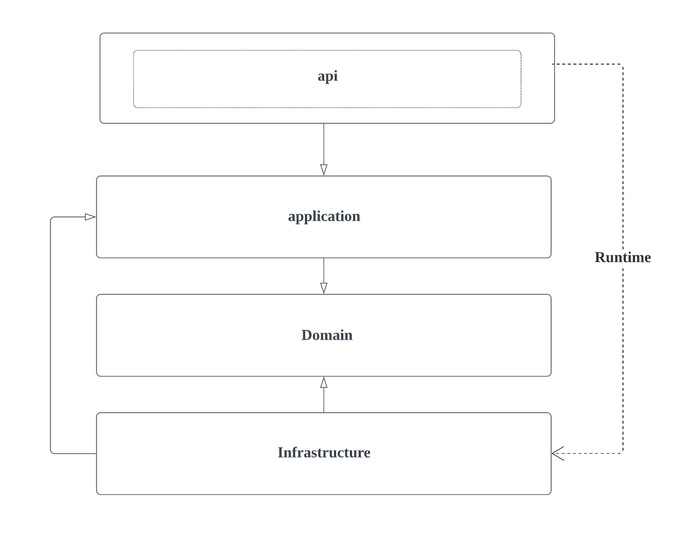
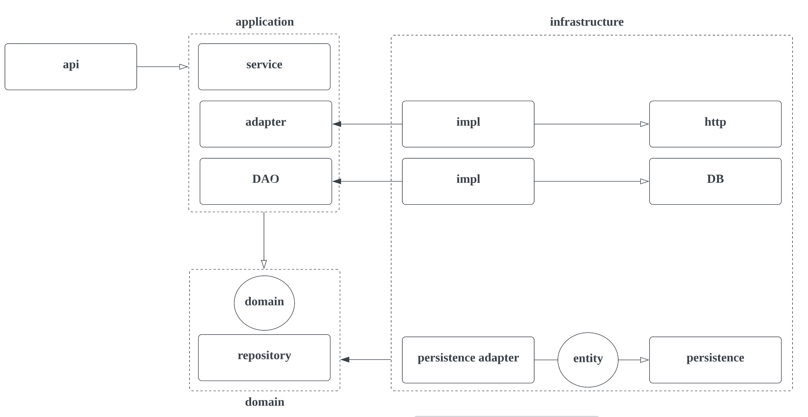

# DDD + Multi module, Mono repo

DDD + 멀티모듈

### 😊 Prerequisites

- [Java 11]
- [Gradle 7.5 or later](https://gradle.org) (not required. use gradle wrapper)

## Basic concept

아래 디렉토리 구조를 참고하세요.

```text
monorepo                         - root module
├── common-lib                   - 공통 라이브러리   
│   └── util                     - 서비스 공통 유틸
├── api                          - API
│   └── api                                            
├── application                  - Application
├── infrastructure               - Infrastructure
├── domain                       - Domain
└── database                     - Database Versioning (flyway) TODO
```

### 📦 modules



### 📦 packages



## Tech Stack

### Language

- API 서버의 경우 [Kotlin](https://kotlinlang.org) 을 사용합니다.

### Serverside Framework

- API 서버의 경우 [SpringBoot](https://spring.io/projects/spring-boot) 를 사용합니다.

### Persistence Framework

- JPA - [Hibernate](https://hibernate.org) 를 사용하고 있습니다.
- [Spring Data JPA](https://spring.io/projects/spring-data-jpa) 를 사용합니다.
- 다이나믹한 쿼리를 생성하기 위해 [Querydsl](http://querydsl.com) 을 사용합니다.

### Test Framework

- [JUnit5](https://github.com/junit-team/junit5) 를 사용합니다.
- Fixture 생성을 위한 라이브러리로 [Fixture Monkey](https://naver.github.io/fixture-monkey) 를 사용합니다.
- [mockk](https://mockk.io/) 를 사용합니다.
